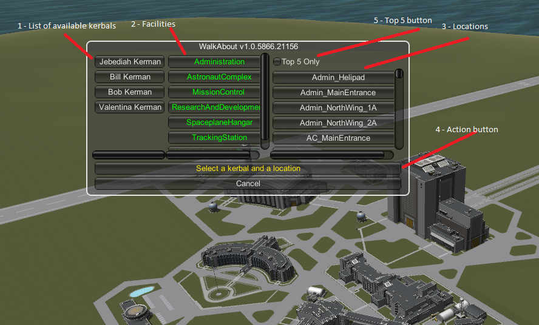
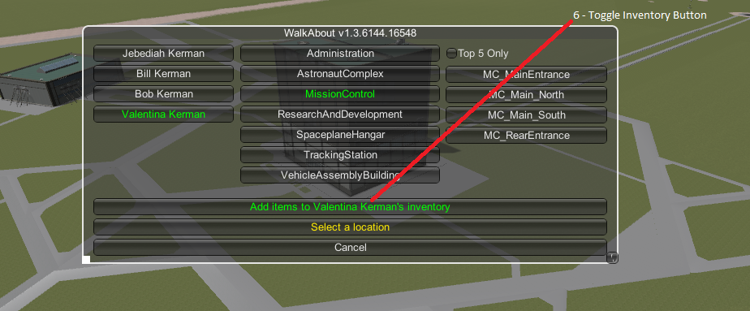
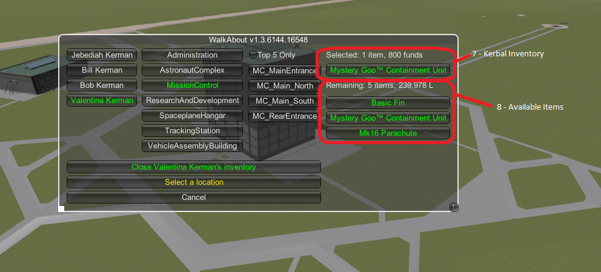

# Walk About /L Unleashed

The WalkAbout mod allows you to take an available Kerbal from the Astronaut Complex and have him/her placed outside any door at the KSC.

[Unleashed](https://ksp.lisias.net/add-ons-unleashed/) fork by Lisias.

## In a Hurry

* [Latest Release](https://github.com/net-lisias-kspu/WalkAbout/releases)
    + [Binaries](https://github.com/net-lisias-kspu/WalkAbout/tree/Archive)
* [Source](https://github.com/net-lisias-kspu/WalkAbout)
* Documentation
	+ [Project's README](https://github.com/net-lisias-kspu/WalkAbout/blob/master/README.md)
	+ [Change Log](./CHANGE_LOG.md)

## Description

The WalkAbout mod allows you to take an available Kerbal from the Astronaut Complex and have him/her placed outside any door at the KSC (see Placement, see note 6).

It also allows you to move your Kerbal around without having to hold down the W-A-S-D keys (see Perpetual Motion below).

### Placement:

You can activate WalkAbout from the Space Centre scene by pressing ctrl-W. The WalkAbout selections screen will appear.

1. List of available Kerbals.
	+ any Lerbal currently not assigned to a craft or on EVA will appear in this list. 
	+ Simply click on a Kerbal to select that one.
2.Facilities
	+ a list of the KSC facilities with locations for placing Kerbals.
	+ Click on one of these to restrict the list of Locations (see below) to only those locations associated with the facility.
3. Locations
	+ list of all locations where a Kerbal may be placed.
	+ Or, if a facility has been selected, a list of all locations associated with that facility.
	+ See notes 1, 2, 3 and 4.
4. Action Button
	+ when the button text is green, click it to send your Kerbal on WalkAbout.
5. Top 5 Button
	+ Restricts the locations shown to only the top 5 most commonly selected locations.
	+ See notes 3, 4 and 5.

For players who use the Kerbal Inventory System mod:

6. Toggle Inventory Button (only appears if the Kerbal Inventory System mod is installed)
	+ turns the inventory display on or off
7. Kerbal's Inventory
	+ lists all items in the selected Kerbal's inventory.
8. Available Items
	+ list all items that can be added to the Kerbal's inventory.

#### Notes

* Note 1
	+ Locations are recorded in the .loc files.  Each location corresponds to a position just outside of one of the doors found on the outside of the buildings of the KSC.  
	+ I have tried to catalogue every door available at each of the 3 levels of upgrade for all of the buildings, but as you may imagine, it would be easy for me to miss one (or two (or three (...)))).  If you notice any doors or exits that I have missed, please let me know on the forum page.
* Note 2:
	+ Since the individual buildings in KSP are not named, I tried to come up with a generic naming convention for the buildings and the locations.  Most location names are formatted as follows ff_bldg[_subsection]_[d]ls  where
		- `ff` is an abbreviation of the facility name,
		- `bldg` is a name for the building
		- `subsection` may be a wing or a separate building name (eg ..._QuonsetF_...)
		- `d` is the direction the side of the building faces (N, S, E, W)
		- `l` is the floor #
		- `s` is the sequence letter for the door (A, B, C...).
	+ So R+D_WindTunnel_BldgC_N1B is 2nd door on the first floor of the north side of Building C of the Wind Tunnel complex of the R&D facility.
* Note 3:
	+ When the selection screen first appears, all locations for all facilities are shown.  Use the Facilities selector and/or the Top 5 button to limit the number of locations shown.
* Note 4:
	+ Locations are shown in alphabetical order.  However, each time a location is used, it is moved up the list thereby keeping the most often used locations at the top of list.  
* Note 5:
	+ The Top 5 button is not limited to 5 entries.  The number of locations selected by this button can be set by altering the value for TopFew in the `settings.cfg` file.
* Note 6:
	+ Placing Kerbals in locations where a portion of the building is above them has proven problematic.  As a result locations for doors on all but the bottom and top levels of most stairwells have been omitted.  This is also why Kerbals are placed beyond any projecting awnings and eaves.

### Perpetual Motion:

When a Kerbal is on EVA, it is now possible to walk/swim or run without having to hold down the movement keys. To do this enter Perpetual Motion mode by pressing the activation key (single quote ['] - see note 1). Your Kerbal should now start walking forward (see note 2).

* The movement keys (W-A-S-D) will now change your Kerbal's direction of movement. See note 2.
* The run key (left-shift) will act as a toggle, switching your Kerbal's movement between walking and running.
* Time acceleration is limited to physics time-warp only (1x, 2x, 3x, 4x).
* Pressing the activation key again will take you out of Perpetual Motion mode.

#### Notes

* Note 1:
	+ The activation key is configurable in the settings.cfg file.
* Note 2:
	+ In Perpetual Motion mode the Kerbal always moves forward (in the direction it is facing).
* Note 3
	+ Direction change is relative to the camera. So pressing W turns the Kerbal to same direction as camera is facing.

## Installation

To install, place the GameData folder inside your Kerbal Space Program folder.

**REMOVE ANY OLD VERSIONS OF THE PRODUCT BEFORE INSTALLING**.

### Dependencies

* Hard Dependencies
	* [KSP Extended](https://github.com/net-lisias-ksp/KSPe) 2.5 or newer 
* Soft Dependencies
	* [Module Manager](https://github.com/sarnet-lisias-ksp/ModuleManager)

### Licensing

This work is licensed under the [GPL 3.0](https://www.gnu.org/licenses/gpl-3.0.txt). See [here](./LICENSE)

+ You are free to:
	- Use : unpack and use the material in any computer or device
	- Redistribute : redistribute the original package in any medium
	- Adapt : Reuse, modify or incorporate source code into your works (and redistribute it!) 
+ Under the following terms:
	- You retain any copyright notices
	- You recognise and respect any trademarks
	- You don't impersonate the authors, neither redistribute a derivative that could be misrepresented as theirs.
	- You credit the author and republish the copyright notices on your works where the code is used.
	- You relicense (and fully comply) your works using GPL 3.0
		- Please note that upgrading the license to any future license version  **IS NOT ALLOWED** for this work, as this Author **DID NOT** added the "or (at your option) any later version" on the license
	- You don't mix your work with GPL incompatible works.

See [NOTICE](./NOTICE) for further copyright and trademarks notices.

The Original Author's work, where upgrading licenses are allowed, can be found on the Source's branches (see **UPSTREAM** below).

Please note that *"That phrase is not part of the GPL itself, it is included by whoever is applying the GPL to their code"*. [Source](https://opensource.stackexchange.com/questions/6262/what-is-the-purpose-of-or-at-your-option-any-later-version-what-if-i-dont).

Also, *"However, developers are not obligated to do this; developers can continue allowing use of the previous version of the GPL, if that is their preference."*. [Source](https://www.gnu.org/licenses/gpl-faq.html#VersionThreeOrLater).

## Acknowledgements

Many thanks to Diazo, Crzyrndm, IgorZ, and LabRats for helping the Original Author out in the forums.

And thanks too to mod creators KospY (KIS), MSK (EVA-Follower), MrHappyFace (Better Time Warp), The kOS Team (kOS), and Qberticus (Haystack Continued) for creating the code that helped the Original Author to figure out how to do most of this.

## UPSTREAM

* [linuxgurugamer](https://forum.kerbalspaceprogram.com/index.php?/profile/129964-linuxgurugamer/) CURRENT MAINTAINER
	+ [Forum](https://forum.kerbalspaceprogram.com/topic/193732-112x-walkabout/)
	+ [SpaceDock](https://spacedock.info/mod/228/WalkAbout#info)
	+ [GitHub](https://github.com/linuxgurugamer/WalkAbout)
* [Antipodes](https://forum.kerbalspaceprogram.com/profile/157104-antipodes/) ROOT
	+ [Forum](https://forum.kerbalspaceprogram.com/topic/130575-13-walkabout-v171-17-07-2017/)
	+ [SpaceDock](https://spacedock.info/mod/228/WalkAbout#info)
	+ Source
		- available on the distribution zips on [Archive](https://github.com/net-lisias-kspu/WalkAbout/tree/Archive).
		- On the following branches for conveniency:
			- [KSP 1.0](https://github.com/net-lisias-kspu/WalkAbout/tree/KSP/1.0)
			- [KSP 1.1](https://github.com/net-lisias-kspu/WalkAbout/tree/KSP/1.1)
			- [KSP 1.2](https://github.com/net-lisias-kspu/WalkAbout/tree/KSP/1.2)
			- [KSP 1.3](https://github.com/net-lisias-kspu/WalkAbout/tree/KSP/1.3)
